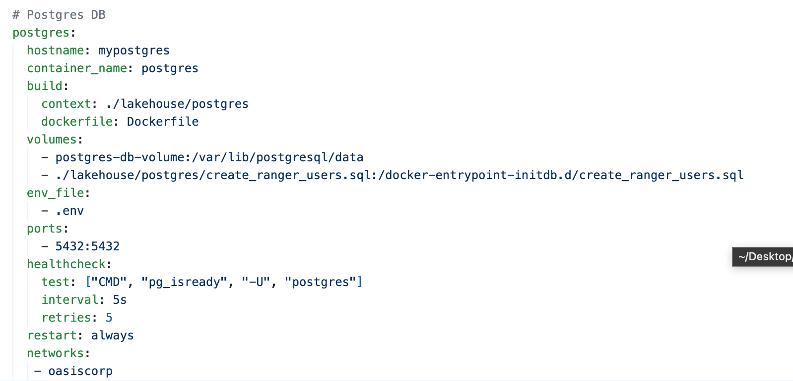

# Volume 3:  
This chapter is divided into three main sections and exercises:

A crash course on PostgreSQL on Docker.
Connecting the RDBMS world with Spark SQL using JDBC.
Additional exercises.
Let's get started by setting up our development environments and diving into these topics!

---
# Workshop Material

## 1. Setting up PostgreSQL on Docker
### 1.1 File Location:
Navigate to the `vol-03` directory, this is where the `docker-compose.yml` file is located:

- `start` --> `docker` --> `docker-compose.yml`.

### 1.2. Docker Compose File

This is a service configuration specified in a docker-compose.yml file.



- The service is named `postgres` and will be used to run a Postgres database.
- The hostname of the container will be set to `mypostgres`.
- The container will be given the name `postgres`.
- The image for the container will be built using a Dockerfile located in the ./lakehouse/postgres directory.
Two volumes will be mounted to the container:
- A volume named `postgres-db-volume` will be mounted to the /var/lib/postgresql/data directory in the container. This is where Postgres will store its data.
- A file named `create_ranger_users.sql` located in the ./lakehouse/postgres directory will be mounted to the /docker-entrypoint-initdb.d directory in the container. This file will be executed when the container is started and will create some Ranger users in the Postgres database.
- An environment file named `.env` will be used to set environment variables in the container.
- The environment variables will be used to set the username, password, and database name for the Postgres database.
- The container will expose port 5432, which is the default port for Postgres.
- A health check will be performed on the container every 5 seconds using the "pg_isready" command to ensure that the container is healthy.
- The container will be restarted automatically if it fails or is stopped.
- The container will be connected to a network named `oasiscorp`.

### 1.3. Dockerfile

The Dockerfile is used to build the image for the container. The Dockerfile is located in the ./lakehouse/postgres directory.

This is a Dockerfile used to build an image for a Postgres database with Hive schema and upgrade scripts.
- The image is based on the official Postgres 9.5.3 image.
The following files are copied from the local file system to the image:
 - hive-schema-2.3.0.postgres.sql: This file contains the Hive schema definition for Postgres.
 - hive-txn-schema-2.3.0.postgres.sql: This file contains the Hive transactional schema definition for Postgres.
 - upgrade-2.3.0-to-3.0.0.postgres.sql: This file contains the script to upgrade the Hive schema from version 2.3.0 to version 3.0.0 for Postgres.
 - upgrade-3.0.0-to-3.1.0.postgres.sql: This file contains the script to upgrade the Hive schema from version 3.0.0 to version 3.1.0 for Postgres.
 - These files are copied to the /var/lib/postgresql/hive directory in the image, which is where Hive expects them to be located.


 ### 1.4. init-hive-db.sh

 - The init-hive-db.sh script is copied to the /docker-entrypoint-initdb.d directory in the image. This script is executed when the container is started and will initialize the Hive database in Postgres by executing the schema and upgrade scripts.

This script is used to initialize a Hive metastore database on a Postgres server.

 - The "set -e" command sets the script to exit immediately if any command exits with a non-zero status (i.e. an error occurs).
 - The "psql" command is used to connect to the Postgres server and execute SQL commands.
 - The "CREATE USER" command creates a new user in Postgres named "hive" with a password of "hive".
 - The "CREATE DATABASE" command creates a new database in Postgres named "metastore".
 - The "GRANT ALL PRIVILEGES" command grants all privileges on the "metastore" database to the "hive" user.
 - The "\c" command switches the connection to the "metastore" database.
 - The "\i" command executes SQL commands from a file.
 
The script is now complete and the Hive metastore database is initialized and ready for use with Postgres.

- The image is now ready to be used to run a Postgres database with Hive schema and upgrade scripts.

## 2. Starting the Docker Container
To start the PostgreSQL container, run the following command from the ./vol-02/start/docker directory:

Start the Docker Container
~~~
cd  volume-two/start/docker/ && ./run.sh start
~~~

OR 

```
docker compose -f docker-compose.yml up -d
```


## 2.1 Creating Datasets with MySQL
MySQL Docker Environment

This chapter’s docker environment spins up MySQL 8.
The user dataeng has been created for working with MySQL data in Spark.
The password is customized in the docker-compose-all.yaml under MYSQL_PASSWORD (dataengineering_user).

To get into the MySQL console, use the following. When prompted use the password dataengineering_user:

```
docker exec -it mysql bash
mysql -u dataeng -p
```

When you are logged in. You should see the following:
  
  ```
Welcome to the MySQL monitor.  Commands end with ; or \g.
Your MySQL connection id is 11
Server version: 8.0.23 MySQL Community Server - GPL

Copyright (c) 2000, 2021, Oracle and/or its affiliates.

Oracle is a registered trademark of Oracle Corporation and/or its
affiliates. Other names may be trademarks of their respective
owners.

Type 'help;' or '\h' for help. Type '\c' to clear the current input statement.

mysql> 
  ```

## 2.2 Create a Table and add some Data
1. Reconnect to the Docker mysql container. `docker exec -it mysql bash` and run `mysql -u dataeng -p` and re-enter your password.
2. Create the customers table
3. Add some customers

### 2.3 Create the Customers Table
~~~
CREATE TABLE IF NOT EXISTS customers (
  id VARCHAR(32),
  created TIMESTAMP DEFAULT CURRENT_TIMESTAMP,
  updated TIMESTAMP DEFAULT CURRENT_TIMESTAMP ON UPDATE CURRENT_TIMESTAMP,
  first_name VARCHAR(100),
  last_name VARCHAR(100),
  email VARCHAR(255)
);

~~~

### 2.4 Add Some Customers to your Table
~~~
INSERT INTO customers (id, first_name, last_name, email)
VALUES
(1, 'Scott', 'Haines', 'scott@coffeeco.com'),
(2, 'John', 'Hamm', 'john.hamm@acme.com'),
(3, 'Milo', 'Haines', 'mhaines@coffeeco.com');
~~~

### 2.5 Query the Customers Table

~~~
mysql> select * from customers;
~~~

Oytput:
~~~
+----+---------------------+---------------------+------------+-----------+-------------------------+
| id | created             | updated             | first_name | last_name | email                   |
+----+---------------------+---------------------+------------+-----------+-------------------------+
| 1  | 2021-04-07 18:00:00 | 2021-04-07 18:00:00 | Scott      | Haines    |
| 2  | 2021-04-07 18:00:00 | 2021-04-07 18:00:00 | John       | Hamm      |
| 3  | 2021-04-07 18:00:00 | 2021-04-07 18:00:00 | Milo       | Haines    |
+----+---------------------+---------------------+------------+-----------+-------------------------+
3 rows in set (0.00 sec)
~~~


### 2.6 Exit the MySQL cli
When you are done in the MySQL cli, just exit with exit command.
~~~
mysql> exit
Bye
~~~


### 3.0 Creating Datasets with Postgres

To start the PostgreSQL container, run the following command from the ./vol-02/start/docker directory:

```
docker exec -it postgres_container psql -U oasis -d oasiscorp
```

Great! You have successfully started the PostgreSQL container.


The customers table is a simple table storing customer information. This table represents a basic registered customer within CoffeeCo.
To create the customers table, run the following command:

```
CREATE TABLE IF NOT EXISTS bettercustomers (
  id SERIAL PRIMARY KEY,
  created TIMESTAMP DEFAULT CURRENT_TIMESTAMP,
  updated TIMESTAMP DEFAULT CURRENT_TIMESTAMP,
  first_name VARCHAR(100) NOT NULL,
  last_name VARCHAR(100) NOT NULL,
  email VARCHAR(255) NOT NULL UNIQUE
);
```

### 3.1. Inserting Data into the Customers Table
The following command will insert data into the customers table:

```
INSERT INTO bettercustomers (first_name, last_name, email)
VALUES ('John', 'Doe', 'johndoe@example.com'),
       ('Jane', 'Smith', 'janesmith@example.com'),
       ('Bob', 'Johnson', 'bobjohnson@example.com'),
       ('Alice', 'Lee', 'alicelee@example.com'),
       ('David', 'Kim', 'davidkim@example.com'),
       ('Linda', 'Nguyen', 'lindanguyen@example.com'),
       ('Mike', 'Garcia', 'mikegarcia@example.com'),
       ('Emily', 'Chen', 'emilychen@example.com'),
       ('Ryan', 'Wong', 'ryanwong@example.com'),
       ('Karen', 'Zhao', 'karenzhao@example.com');
```
Let’s do a quick sanity check to make sure things look alright before we exit the Postgres shell and move over to the Jupyter Lab.

### 3.2. Querying the Customers Table
To query the customers table, run the following command:

```
SELECT * FROM bettercustomers;
```
Great! You have successfully created the customers table and inserted data into it.


### 4. Setting up Jupyter Notebook

Go to http://localhost:8888 to see the jupyter lab homepage.

---
* For Jupyter notebook, you must copy the URL with the token generated when the container is started and paste in your browser. 
* The URL with the token can be taken from container logs using:
 
```
docker logs $(docker ps -q --filter "ancestor=jupyter/pyspark-notebook:spark-3.2.0") 2>&1 | grep 'http://127.0.0.1' | tail -1
```
---

