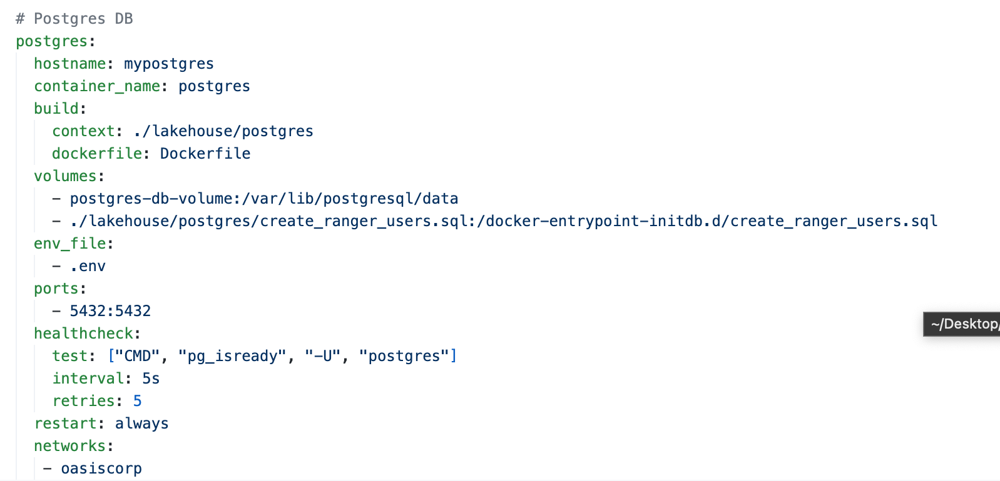

# Volume 3:  
This chapter is divided into three main sections and exercises:

A crash course on PostgreSQL on Docker.
Connecting the RDBMS world with Spark SQL using JDBC.
Additional exercises.
Let's get started by setting up our development environments and diving into these topics!

---
# Workshop Material

## 1. Setting up PostgreSQL on Docker
### 1.1 File Location:
Navigate to the `vol-03` directory, this is where the `docker-compose.yml` file is located:

- `start` --> `docker` --> `docker-compose.yml`.

### 1.2. Docker Compose File

This is a service configuration specified in a docker-compose.yml file.



- The service is named `postgres` and will be used to run a Postgres database.
- The hostname of the container will be set to `mypostgres`.
- The container will be given the name `postgres`.
- The image for the container will be built using a Dockerfile located in the ./lakehouse/postgres directory.
Two volumes will be mounted to the container:
- A volume named `postgres-db-volume` will be mounted to the /var/lib/postgresql/data directory in the container. This is where Postgres will store its data.
- A file named `create_ranger_users.sql` located in the ./lakehouse/postgres directory will be mounted to the /docker-entrypoint-initdb.d directory in the container. This file will be executed when the container is started and will create some Ranger users in the Postgres database.
- An environment file named `.env` will be used to set environment variables in the container.
- The environment variables will be used to set the username, password, and database name for the Postgres database.
- The container will expose port 5432, which is the default port for Postgres.
- A health check will be performed on the container every 5 seconds using the "pg_isready" command to ensure that the container is healthy.
- The container will be restarted automatically if it fails or is stopped.
- The container will be connected to a network named `oasiscorp`.

### 1.3. Dockerfile

The Dockerfile is used to build the image for the container. The Dockerfile is located in the ./lakehouse/postgres directory.

This is a Dockerfile used to build an image for a Postgres database with Hive schema and upgrade scripts.
- The image is based on the official Postgres 9.5.3 image.
The following files are copied from the local file system to the image:
 - hive-schema-2.3.0.postgres.sql: This file contains the Hive schema definition for Postgres.
 - hive-txn-schema-2.3.0.postgres.sql: This file contains the Hive transactional schema definition for Postgres.
 - upgrade-2.3.0-to-3.0.0.postgres.sql: This file contains the script to upgrade the Hive schema from version 2.3.0 to version 3.0.0 for Postgres.
 - upgrade-3.0.0-to-3.1.0.postgres.sql: This file contains the script to upgrade the Hive schema from version 3.0.0 to version 3.1.0 for Postgres.
 - These files are copied to the /var/lib/postgresql/hive directory in the image, which is where Hive expects them to be located.


 ### 1.4. init-hive-db.sh

 - The init-hive-db.sh script is copied to the /docker-entrypoint-initdb.d directory in the image. This script is executed when the container is started and will initialize the Hive database in Postgres by executing the schema and upgrade scripts.

This script is used to initialize a Hive metastore database on a Postgres server.

 - The "set -e" command sets the script to exit immediately if any command exits with a non-zero status (i.e. an error occurs).
 - The "psql" command is used to connect to the Postgres server and execute SQL commands.
 - The "CREATE USER" command creates a new user in Postgres named "hive" with a password of "hive".
 - The "CREATE DATABASE" command creates a new database in Postgres named "metastore".
 - The "GRANT ALL PRIVILEGES" command grants all privileges on the "metastore" database to the "hive" user.
 - The "\c" command switches the connection to the "metastore" database.
 - The "\i" command executes SQL commands from a file.
 
The script is now complete and the Hive metastore database is initialized and ready for use with Postgres.

- The image is now ready to be used to run a Postgres database with Hive schema and upgrade scripts.

## 2. Starting the Docker Container
To start the PostgreSQL container, run the following command from the ./vol-02/start/docker directory:

```
docker compose -f docker-compose.yml up -d
```

To verify that the container is running, run the following command:

```
docker exec -it postgres psql -U oasis -d oasiscorp
```

### 2.1. Setting up your environment

Setting up your environment is covered in Volume 1, but as long as you have the following set in your local env `bash or zsh`, you will be golden.
1. JAVA_HOME - (must be java 8 or java 11)
2. SPARK_HOME - (we are using spark 3x)


Start the Docker Container
~~~
cd  volume-two/start/docker/ && ./run.sh start
~~~

### 2.2. Setting up Jupyter Notebook

Go to http://localhost:8888 to see the jupyter lab homepage.

---
* For Jupyter notebook, you must copy the URL with the token generated when the container is started and paste in your browser. 
* The URL with the token can be taken from container logs using:
 
```
docker logs $(docker ps -q --filter "ancestor=docker-jupyter") 2>&1 | grep 'http://127.0.0.1' | tail -1
```
---


